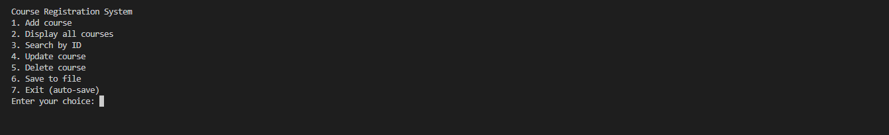
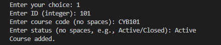
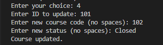
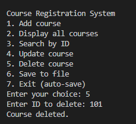

# 📚 Course CSV Manager (C Project)


A **course registration system in C** with CSV persistence.  
Users can add, search, update, delete, and list courses via a menu-driven interface.

---

## 📌 Features
- Add a course (ID, code, status)
- Display all courses in memory
- Search courses by ID
- Update or delete an existing course
- Save/load data to/from `regs.txt` (CSV file)
- Demonstrates **structs, arrays, file I/O, and persistence**

---

## 📸 Example Output (Screenshots)

**Menu**  


**Add & Display**  


**Update**  


**Delete**  


---

## 🛠️ Compilation & Usage

Make sure you have `gcc` installed.  
Clone the repository and compile the program:

```bash
gcc course-csv-manager-c.c -o course_manager
./course_manager
